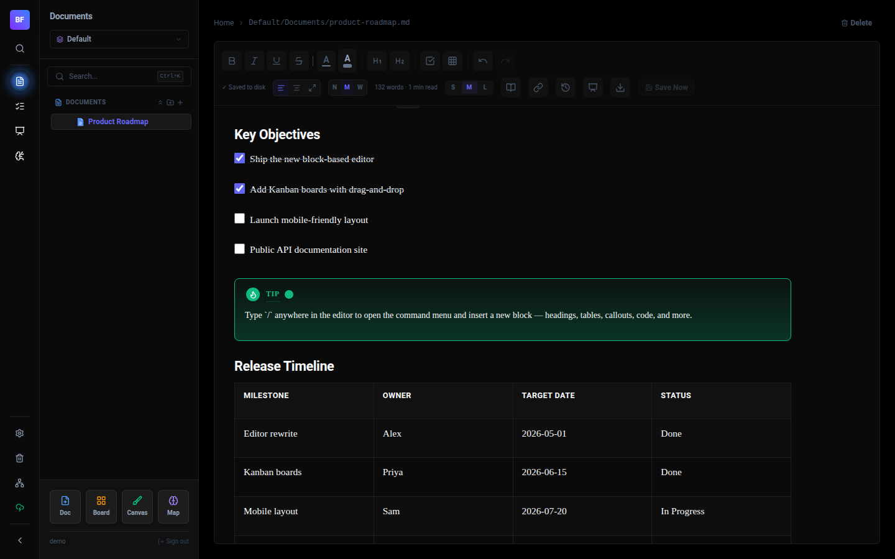
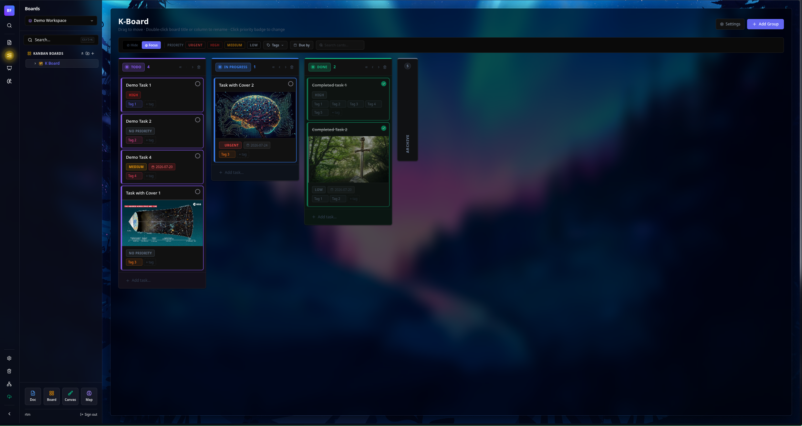
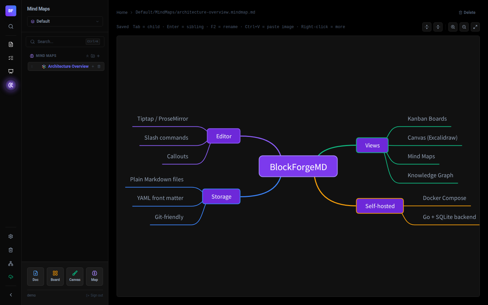
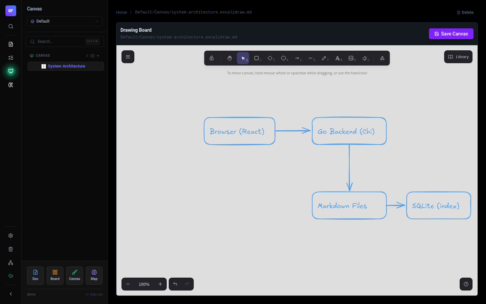

# BlockForgeMD `v1.0`

> A local-first knowledge base built on plain Markdown. Your notes live as files on disk -> portable, integrable with any tool, and independent of any cloud service.

**Motivation:** A Personal Knowledge Management (PKM) system with a fully functional web interface, self-hosted on top of plain Markdown files. Every document, board, canvas, and mind map you create is stored as a standard `.md` file you can read, edit, move, or process with any other tool — forever.

---

## Screenshots

| Document editor                                                                                                                                             | Kanban board                                                                                                                                          |
| ----------------------------------------------------------------------------------------------------------------------------------------------------------- | ----------------------------------------------------------------------------------------------------------------------------------------------------- |
|  |  |

| Mind map                                                                                                           | Canvas                                                                                                                             |
| ------------------------------------------------------------------------------------------------------------------ | ---------------------------------------------------------------------------------------------------------------------------------- |
|  |  |

---

## Why BlockForgeMD

|                 | BlockForgeMD                                                                         |
| --------------- | ------------------------------------------------------------------------------------ |
| **Storage**     | Files on your disk, documents as plain `.md`, visual types as structured containers  |
| **Hosting**     | Self-hosted, no cloud required                                                       |
| **Portability** | Documents open in any Markdown editor; all file types are human-readable text        |
| **Privacy**     | Your server, your data                                                               |
| **Integration** | Works with git, Obsidian, VSCode, scripts, CI pipelines... anything that reads files |

---

## Quick Start

### Docker Compose

```bash
docker compose up -d --build
```

Then open [http://localhost:8080](http://localhost:8080) and follow the setup wizard.

---

## Stack

- **Backend** — Go, SQLite (metadata index), Chi router
- **Frontend** — React, Tiptap / ProseMirror, Tailwind CSS
- **Deployment** — Docker Compose (single container, single port)

---

## Features

### Editor

A rich Markdown editor built on [Tiptap](https://tiptap.dev/) with real-time WYSIWYG editing and full Markdown compatibility.

**Inline formatting**

- Bold, italic, underline, strikethrough, inline code
- Text colour and background highlight (12 colours)
- Superscript / subscript
- Links

**Block types — type `/` to open the command menu**

| Command           | Description                                             |
| ----------------- | ------------------------------------------------------- |
| `# ` `## ` `### ` | Heading 1 / 2 / 3                                       |
| `- `              | Bullet list                                             |
| `1. `             | Numbered list                                           |
| `[] `             | Task / checklist                                        |
| `> `              | Blockquote                                              |
| ` ``` `           | Code block (20+ languages, syntax highlighted)          |
| `/table`          | Table grid                                              |
| `/toc`            | Live table of contents (auto-updates with headings)     |
| `/callout`        | Callout box: Note, Tip, Warning, Danger, Bug, or custom |
| `/math`           | LaTeX / KaTeX math block (also inline with `$formula$`) |
| `/2col` `/3col`   | Multi-column layout                                     |
| `/embed`          | Embed a URL, canvas, or mind map                        |
| `/subpage`        | Create a nested sub-page inline                         |

**Block operations (right-click any block)**

- Move block up / down
- Duplicate block
- Delete block
- Convert / transform to a different block type
- Apply text colour or background colour

**Page properties panel** (YAML front matter, visible per document)

- Title, icon/emoji, cover image
- Status, priority, tags
- Assignee (from workspace users)
- Due date with optional time picker
- File attachments
- Word count & estimated reading time

### Views

#### Documents

Standard Markdown documents with nested sub-pages. The sidebar shows a full tree of all your pages.

#### Kanban Boards

Visual task boards stored as Markdown front matter.

- Drag-and-drop cards between columns
- Custom columns (add, rename, reorder, delete)
- Card properties: title, description, priority, due date, assignee, tags, cover image
- Filter bar: filter by assignee, priority, tags, or free-text search
- Focus / highlight modes

#### Canvas (Excalidraw)

Freehand whiteboard powered by [Excalidraw](https://excalidraw.com/). Stored as a `.excalidraw.md` file in YAML front matter header wrapping Excalidraw's JSON format.

#### Diagrams (Draw.io)

Structured diagramming powered by [draw.io](https://www.drawio.com/). Stored as a `.drawio.md` file — YAML front matter header wrapping Draw.io's XML format.

#### Mind Maps

Node-based mind mapping powered by [Mind Elixir](https://mind-elixir.com/). Stored as a `.mindmap.md` file: YAML front matter header wrapping Mind Elixir's JSON format.

#### Knowledge Graph

Interactive force-directed graph of all your documents. Nodes represent pages; edges represent `[[wikilinks]]` between them. Click any node to open the page.

### Workspaces

Group your knowledge into separate workspaces (e.g. Work, Personal, Research). Each workspace has its own Documents, Boards, Canvas, and MindMaps sections. Switch between workspaces from the sidebar.

### Search

Full-text search across all documents in the active workspace. Results show a highlighted snippet of the matching context.

### Favourites

Pin any page to the Favourites section in the sidebar for quick access.

### Trash & Recovery

Deleted files move to trash. Configurable retention period. Restore or permanently delete from the trash view.

### File History

Per-file version history stored in SQLite. Browse and restore any previous version of a document.

### Print / Export

Export a document as a true PDF generated by the server's Chromium renderer. PDFs retain clickable external links and navigable Table of Contents links. The browser **Print…** flow remains available separately for printer-specific options.

### Themes

- **Dark** — deep black palette, optimised for low-light use
- **Light** — clean white palette, high contrast, syntax highlighted code blocks use the GitHub Light palette

### Authentication & Multi-user

- JWT-based session authentication
- Bootstrap flow on first launch to create the admin account
- Multi-user support: create and manage users from Settings
- Per-user API keys for programmatic access (read/write via REST API)

### REST API

The Go backend exposes a REST API that covers all core operations: file CRUD, settings, search, users, workspaces, favourites, history, and trash. Use it with any HTTP client or script.

The full interactive API reference is built in and served at:

```text
http://localhost:8080/docs
```

---

## Plugins

A plugin store (**Settings → Plugins**) for connecting external tools, calendars, and AI providers directly into your workspace.

- **Google Calendar** — 2-way sync between any page's due date and events on your Google Calendar. See [docs/plugins/google-calendar.md](docs/plugins/google-calendar.md) for setup (creating a Google OAuth Client, etc). **Requires BlockForgeMD to be reachable at a real hostname — Google's OAuth rejects private/LAN IP addresses (e.g. `10.x.x.x`, `192.168.x.x`) as redirect URIs outright.** See the doc's requirement callout if you only have a private IP.
- **MCP Servers**, **LLM Providers** — coming soon.

See [docs/plugins/](docs/plugins/) for the full list and setup guides.

---

## Development

**Backend**

```bash
cd backend
go run ./cmd/server
```

**Frontend**

```bash
cd frontend
npm install
npm run dev
```

The frontend dev server proxies API requests to `localhost:8080`.

---

## File Format

Every piece of content is a Markdown file with YAML front matter:

```markdown
---
title: My Note
type: document
tags: [research, draft]
status: In Progress
dueDate: 2026-08-01
---

Your content here, in standard Markdown.
```

Kanban boards, canvases, mind maps, and diagrams embed their data as a fenced code block inside the same `.md` file — so you can read, diff, and version-control everything with git.

**Known limitation — non-Latin titles:** the on-disk filename is derived from the title by stripping everything except `a-z A-Z 0-9`, spaces, and hyphens. A title written entirely in a non-Latin script or in emoji (e.g. fully Japanese, Chinese, Cyrillic, Arabic, or emoji-only) has nothing left after stripping, so creating that page currently fails silently — no file is written and no error is shown. This only affects the generated _filename_; it's unrelated to git, GitHub, or NAS sync, which are fully Unicode-safe and store file content byte-for-byte regardless of what's inside it.

---

## License

[MIT](LICENSE) — Copyright © 2026 RTM
